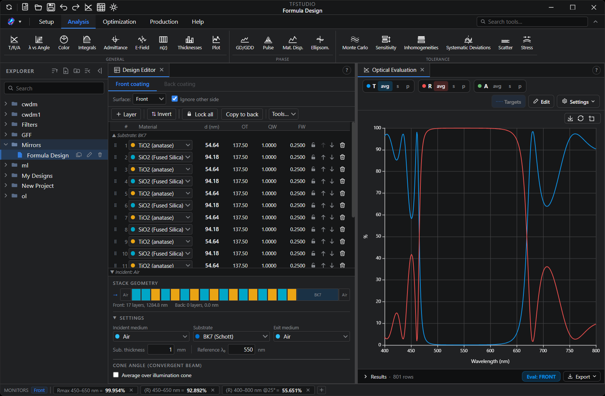
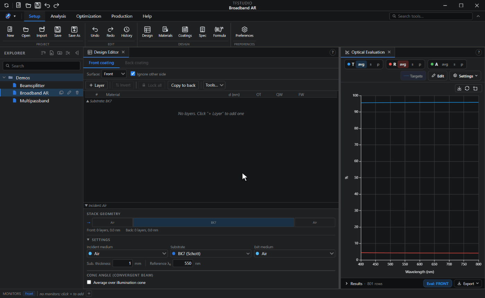
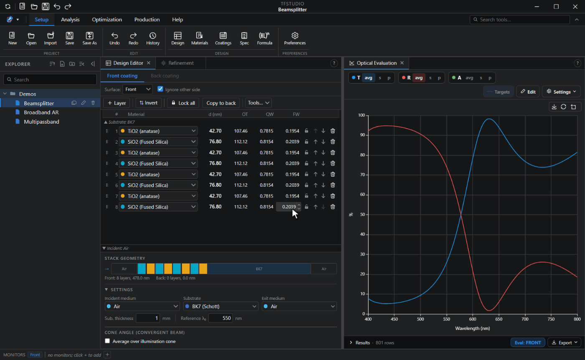
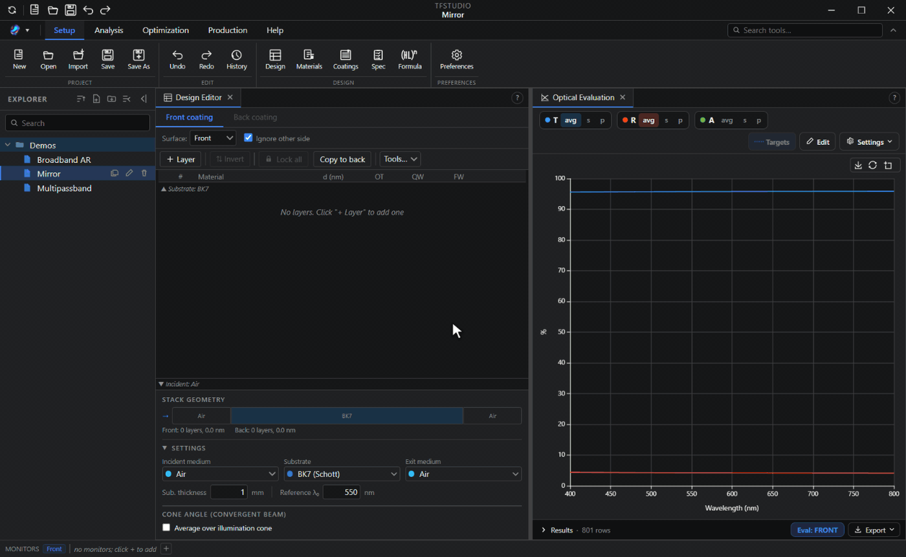
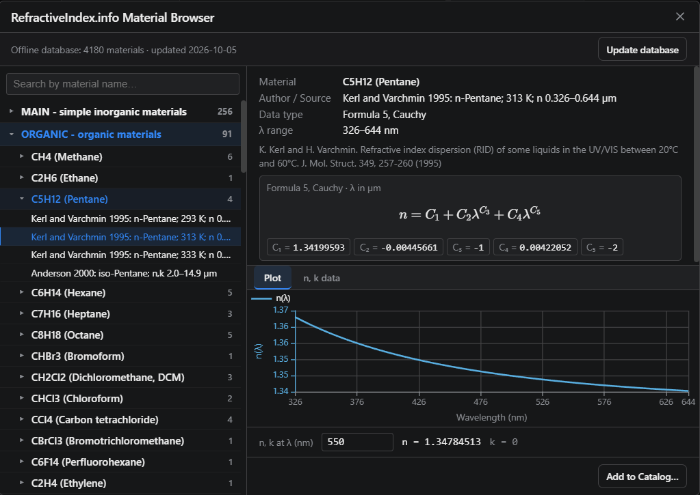

<div align="center">

<picture>
  <source media="(prefers-color-scheme: dark)"
          srcset="https://raw.githubusercontent.com/aai2k/TFStudio/main/assets/banner-on-dark.png">
  
</picture>

**An open-source design, analysis, and optimization environment for optical thin-film coatings.**

[](./LICENSE)

[](../../releases)

[](https://qlty.sh/gh/aai2k/projects/TFStudio)
[](https://doi.org/10.5281/zenodo.21196149)

**[Website](https://tfstudio.xyz)** · **[Tutorials](https://tfstudio.xyz/blog)** · **[Live demo](https://tfstudio.xyz/demo/)** · **[Documentation](https://docs.tfstudio.xyz)** · **[Download](../../releases)** · **[Roadmap](./ROADMAP.md)**

**English** · [简体中文](./README.zh-CN.md)



</div>


## What is TFStudio?

TFStudio is a desktop application for designing and analyzing **optical thin-film coatings**: antireflection coatings, mirrors, beamsplitters, bandpass and edge filters, and more. It provides a double-precision optical engine, refinement and synthesis algorithms, and an analysis suite, in a docked, multi-window interface.


> ⚠️ **Status:** TFStudio is independently developed software. Always verify critical designs against your own calculations and measurements before committing them to a production deposition run.


## Key features

**Design & evaluation**
- Transfer-matrix method (TMM) for **absorbing and dispersive** media at **oblique incidence**, both **s- and p-polarization**
- Full-system modeling: front coating, substrate (with absorption), and back coating, including incoherent substrate multiple reflections
- Design the front coating, the back coating or both at once, the back optionally held as the mirror of the front; every window evaluates one side alone or the whole part
- Averaging over a convergent or divergent illumination cone, with a uniform, Lambertian or tabulated intensity
- Reflectance / transmittance / absorptance spectra in percent, decibels or optical density, color, integral figures of merit
- Layer editor with simultaneous physical / optical / quarter-wave / full-wave thickness representations
- **Stack formula:** build a whole stack from a formula such as `Air | (HL)^4 H | Glass`
- **Specification:** design requirements as live pass/fail checks, turned into merit-function rows with one button and used as the pass criterion of a Monte Carlo yield run
- **Coating library:** coatings kept as reusable stacks with their substrate, medium, band and angle, a built-in shelf of starting designs beside your own, placed on either side of a design

**Optimization & synthesis**
- Refinement methods: SQP with bounds, damped least squares (Levenberg-Marquardt), conjugate gradient, Newton, Newton-CG, multi-start DLS, differential evolution and simulated annealing, or all of them in turn keeping the best; the gradient methods use an **analytic Jacobian**
- **Needle** optimization and **gradual evolution** synthesis (automatic layer insertion from scratch)
- Structural optimization over the layer count itself
- **Filter design wizard:** multi-cavity Fabry-Perot bandpass and notch prototypes (DWDM, LWDM) built in a few guided steps, at normal or oblique incidence
- Flexible merit function: spectral targets, ramps, band averages, worst-case operands, thickness constraints
- Fitting to an imported measured spectrum, as one more row in the merit function
- **Variator:** sliders on each layer's thickness and on the substrate that every open window follows, and on each material's n and k
- **Design cleaner:** merges adjacent layers of one material and removes very thin ones, then refines again if asked
- Multi-threaded via a Web Worker pool; hot kernels accelerated with **WebAssembly**





**Analysis windows**
- Optical evaluation, wavelength vs angle maps, admittance diagrams, electric-field profiles, group delay / GDD, dispersion through a bulk material, ellipsometric parameters, color evaluation, refractive-index profile, layer thickness diagram
- **Plot engine:** custom multi-curve plots, or any quantity mapped over two swept variables as a heatmap or 3D surface
- **Pulse analysis:** a Gaussian, sech² or super-Gaussian pulse, or a measured spectrum with its phase, reflected off or sent through the coating for any number of bounces, drawn against the Fourier-limited pulse of the same spectrum, with output duration, peak, delay and residual GDD
- Tolerance & manufacturing analysis: Monte Carlo error analysis, layer sensitivity, inhomogeneity, roughness/scattering, systematic deviations
- **Stress:** per-film stress with its thermal part, the bow it leaves in the substrate, and how close the stack is to cracking or delaminating, from mechanical constants kept on each material; an `STR` merit operand balances the film force for a flat part



**Materials**
- Built-in library: Sellmeier glasses written out from their papers and the Schott datasheet, and tabulated films and metals generated from the [refractiveindex.info](https://refractiveindex.info) database (CC0)
- Dispersion: the Zemax formulas, general Sellmeier and Cauchy, the OptiLayer Schott, Hartmann and Drude forms, the refractiveindex.info formulas, and tabulated n,k; complex index with explicit conventions
- Import of material catalogs from Zemax AGF, TFCalc, Essential Macleod and OptiLayer files, and an in-app refractiveindex.info browser
- Ships with the Schott glass catalog, coating and substrate material catalogs, and an offline copy of the refractiveindex.info database, so the browser works without a connection



**Measured data**
- Import of measured R / T / A spectra and of ellipsometric Ψ and Δ, drawn over the calculated curves
- Reads delimited text in any common layout (PerkinElmer, Shimadzu, Cary and Filmetrics exports among them), JCAMP-DX, and Woollam and Accurion ellipsometer exports
- **Curve editor:** type, paste or correct a curve's points before it is applied
- **n,k characterization:** derive a film's index, extinction and thickness from a measured transmittance and reflectance, or from a Ψ and Δ pair, and save the result as a material
- Fitting a design to a measured Ψ and Δ: the curve becomes merit-function targets for refinement
- Export of measured or calculated curves in nm, µm or wavenumber, as a fraction or a percentage

**Manufacturing**
- Deposition / monitoring simulation (broadband and monochromatic optical monitoring)
- Monitoring worksheet: per-layer monitoring wavelength and witness-chip assignment, with the layers that cannot be terminated closely enough flagged before the run
- Process exporter
- Coating exchange with lens design software, both ways: Zemax OpticStudio `COATING.DAT` and CODE V MULTILAYER `.seq` / `.mul`
- Design import from TFCalc (`.tfd`), Essential Macleod (`.dds`) and OptiLayer (`.dsg`), with materials matched to your catalogs
- **Report:** a document built from blocks over one or several designs, saved as PDF or a single HTML file

**Platform**
- Cross-platform desktop app (Electron + React, pure JavaScript)
- Tabbed ribbon with a search box that finds any tool by name
- Windows dock, or tear off the layout onto a second monitor
- Built-in help/documentation, English, Russian, Chinese and Italian UI


## Scientific basis

Methods and their sources:

- **Transfer-matrix method:** H. A. Macleod, *Thin-Film Optical Filters*, 5th ed.
- **Numerical needle synthesis:** Sullivan & Dobrowolski, *Appl. Opt.* **35**, 5484 (1996); Tikhonravov et al., *Appl. Opt.* **35**, 5493 (1996)
- **Gradual evolution:** Tikhonravov et al. (2007)
- **Dispersion and pulse propagation:** Birge & Kärtner, *Appl. Opt.* **45**, 1478 (2006)
- **Film stress, substrate bow and failure criteria:** Klokholm, *IBM J. Res. Dev.* **31**, 585 (1987); Suhir, *J. Appl. Phys.* **88**, 2363 (2000); Klein, *J. Appl. Phys.* **88**, 5487 (2000) and *Opt. Eng.* **40**, 1115 (2001)

All computations are double precision.

The transfer-matrix engine is published separately as **[tmmcore](https://github.com/aai2k/tmmcore)**. Its [comparison page](https://aai2k.github.io/tmmcore/comparison/) measures it against `tmm` (Byrnes), `tmm_fast`, `tmmax` and `tmm_faster` on accuracy and speed, and states the method and its caveats. Reference outputs are committed to that repository, so `npm run compare` there reproduces the accuracy table with Node alone and no Python.

## Installation

### Download (recommended)
Grab the latest build for your platform from the [**Releases**](../../releases) page.

**Windows:** `TFStudio.Setup.<ver>.exe` installs normally; `TFStudio-<ver>-Portable.exe` is a single executable that needs no installation, for locked-down deposition PCs. Separate Windows 7/8.1 builds are published alongside.


**Linux:** On Debian and Ubuntu, `TFStudio-<ver>-amd64.deb` is the recommended package:

```bash
sudo apt install ./TFStudio-*-amd64.deb
tfstudio
```

Installing as root is what lets the Chromium sandbox stay enabled. The `.deb` is the only Linux package that keeps it on, and it is also the only one that adds TFStudio to the applications menu and makes `.tfs` designs open in it from the file manager. The AppImage is not installed by anything, so it does not register the file type.

`TFStudio-<ver>-x86_64.AppImage` is the portable alternative:

```bash
chmod +x TFStudio-*-x86_64.AppImage
./TFStudio-*-x86_64.AppImage
```

The AppImage does not need `libfuse2`. Where it cannot mount itself at all, as in a container without FUSE, run it with `--appimage-extract-and-run`.

Want to try it first? Run the **[live web demo](https://tfstudio.xyz/demo/)** for example designs and live spectra in the browser, with no installation required.

### Build from source
Requires [Node.js](https://nodejs.org) 22.12+ and git.

```bash
git clone https://github.com/aai2k/TFStudio.git
cd TFStudio
npm install
npm start          # launch the app
```

The WebAssembly transfer-matrix kernel arrives prebuilt with the `tmmcore`
dependency, so no Emscripten toolchain is needed and source builds get the same
performance as the released binaries.

`npm run build` checks out the refractiveindex.info database submodule and installs
the docs-site dependencies automatically. The database is large; to pull it upfront
instead of on first build, clone with `--recursive`.

Other useful scripts:

```bash
npm test              # run the test suite
npm run docs:dev      # preview the documentation site (installs its deps on first run)
npm run build         # package a distributable (electron-builder)
```

### Packaging releases

`build-release.ps1` provisions everything a fresh clone needs and packages the
installers in one step. It asks which optional targets to include; pass the flags
to answer up front.

```powershell
npm run dist                  # Windows 10/11 installer + portable
npm run dist -- -Win7         # ...and the Windows 7/8.1 builds
npm run dist -- -Linux        # Linux .deb + AppImage only
```

The Linux artifacts are produced by `build-release-linux.sh`, which the release
script drives through WSL; it also runs on any Linux host directly. It needs a
distribution with Node.js 22.12+ and `rsync`, and builds in the Linux filesystem
rather than in place, so a Windows checkout keeps its Windows `node_modules`.
The Windows-driven WSL build skips GUI verification. A direct Linux build launches
the unpacked application under Xvfb as a smoke test, or skips it with a message if
Xvfb is not installed.

Note that the smoke test runs under Xvfb, so it exercises the X11 path only. A
regression that appears solely under native Wayland, such as a window that is
never presented, will pass it.

macOS builds require a macOS host and are not currently published.

User documentation is hosted at **[docs.tfstudio.xyz](https://docs.tfstudio.xyz)**, is built into the app (Help menu), and its source lives in [`docs-site/`](./docs-site).

## Citing TFStudio

If TFStudio contributes to your work, please cite it. Citation metadata is in [`CITATION.cff`](./CITATION.cff); GitHub renders a "Cite this repository" button from it. 

## Contributing

Issues and pull requests are welcome. Because TFStudio is a scientific tool,
contributions to the optical engine are held to a physics-correctness bar (cite
your sources, validate against a reference, add a test). Please read
[**CONTRIBUTING.md**](./CONTRIBUTING.md) before opening a pull request.

By contributing you agree that your contributions are licensed under the project's MIT license.

## License

[MIT](./LICENSE) © 2026 Andrey Achapovsky

## Author

**Andrey Achapovsky:** [ORCID 0009-0005-1497-6279](https://orcid.org/0009-0005-1497-6279)

## Acknowledgements

- Material data derived from the [refractiveindex.info](https://refractiveindex.info) database (CC0, public domain).
- Built with [Electron](https://www.electronjs.org/), [React](https://react.dev/), [Apache ECharts](https://echarts.apache.org/), and [KaTeX](https://katex.org/).
