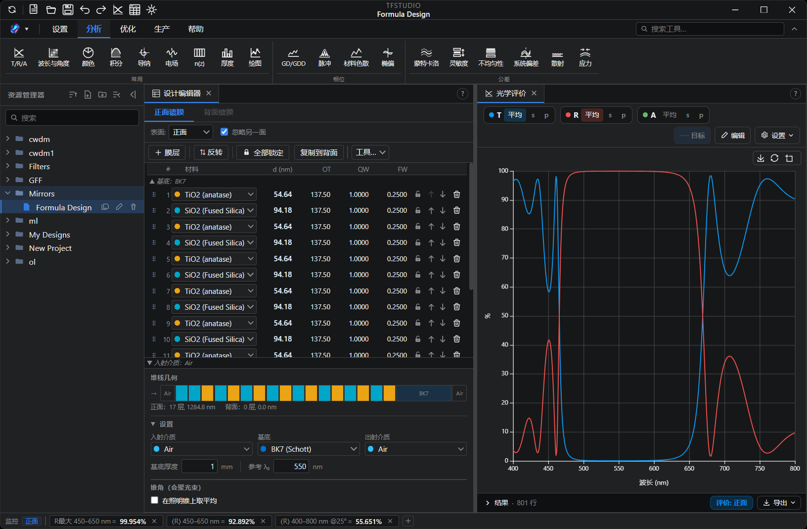
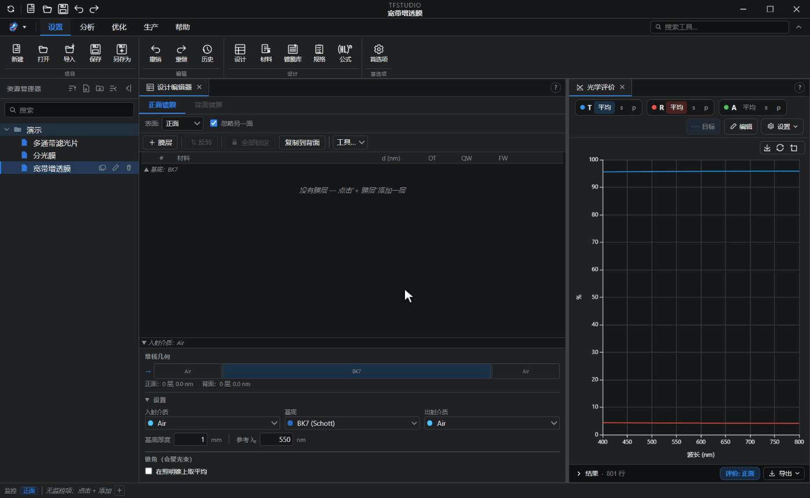
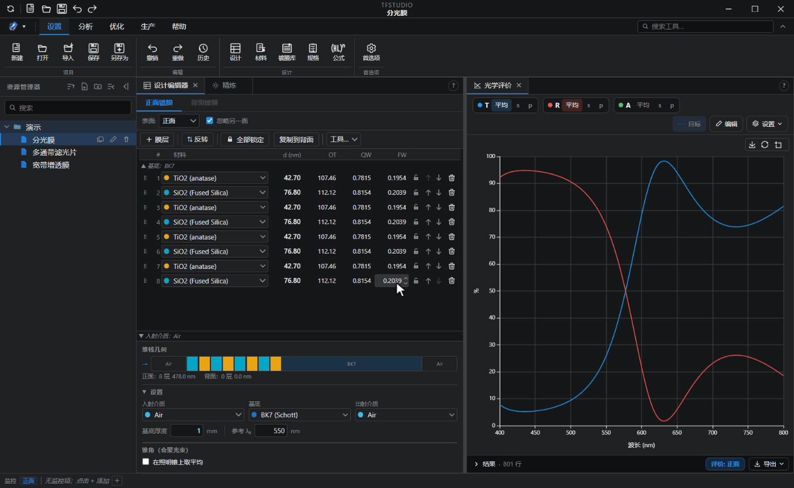
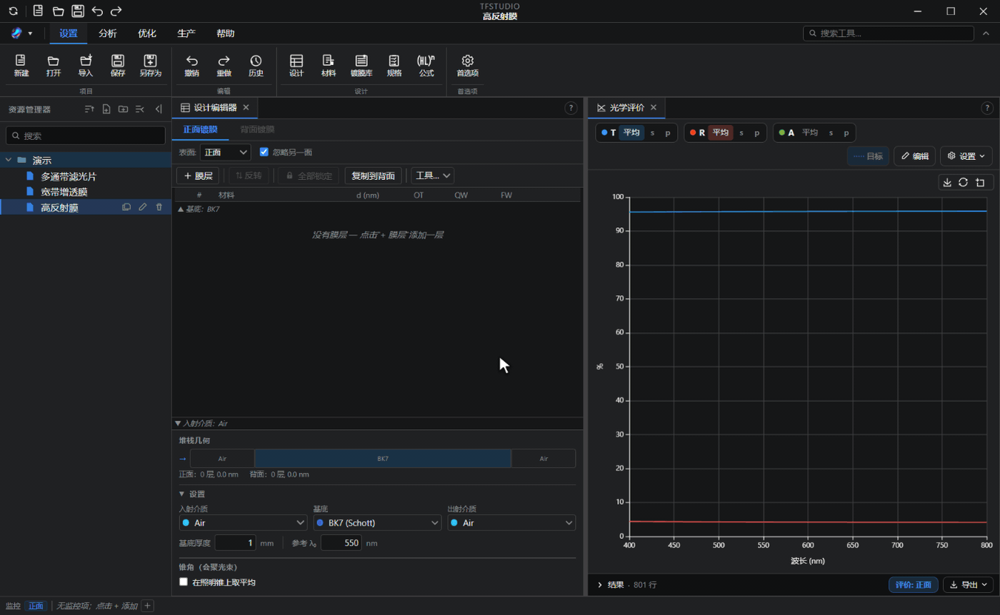
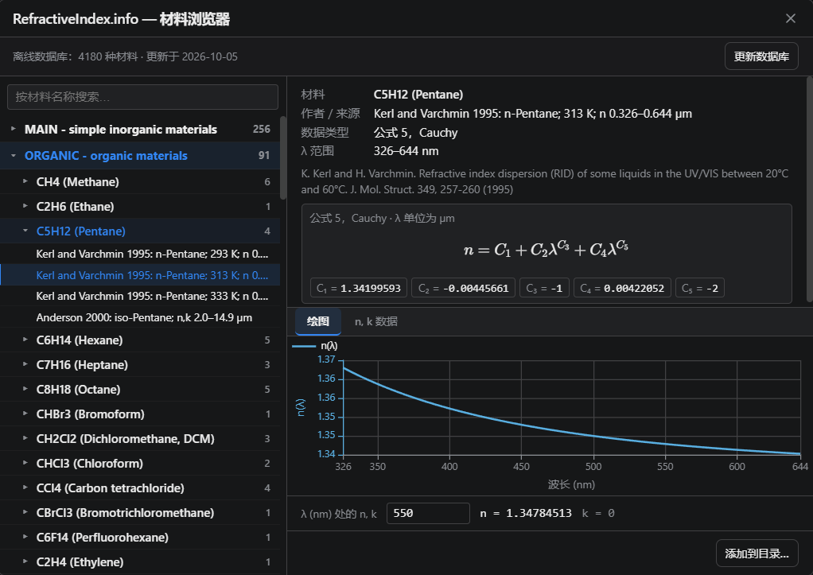

<div align="center">

<picture>
  <source media="(prefers-color-scheme: dark)"
          srcset="https://raw.githubusercontent.com/aai2k/TFStudio/main/assets/banner-on-dark.png">
  
</picture>

**开源的光学薄膜设计、分析与优化环境**

[](./LICENSE)

[](../../releases)

[](https://qlty.sh/gh/aai2k/projects/TFStudio)
[](https://doi.org/10.5281/zenodo.21196149)

**[官网](https://tfstudio.xyz)** · **[教程](https://tfstudio.xyz/blog)** · **[在线演示](https://tfstudio.xyz/demo/)** · **[文档](https://docs.tfstudio.xyz)** · **[下载](../../releases)**

[English](./README.md) · **简体中文**

**软件界面现已支持简体中文。**



</div>

## TFStudio 是什么？

TFStudio 是一款用于**光学薄膜**设计与分析的桌面软件，适用于增透膜、高反射膜、分光膜、带通滤光片、截止滤光片等各类膜系。它提供双精度光学计算引擎、优化与自动合成算法，以及分析工具集，整合在一个可停靠的多窗口界面中。

> ⚠️ **声明：** TFStudio 为独立开发的软件。在将设计结果投入实际镀膜生产之前，请务必用您自己的计算和实测数据加以验证。

## 主要功能

**设计与计算**
- 传输矩阵法（TMM），支持**吸收性和色散性**介质在**斜入射**下的 **s 偏振与 p 偏振**计算
- 完整系统建模：正面膜系、基底（含吸收）与背面膜系，并计入基底内部的非相干多次反射
- 可单独设计正面膜系、背面膜系，或两面同时设计，背面可设为正面的镜像；每个窗口可只评估一面，也可评估整个元件
- 照明锥平均：会聚或发散光束，锥内强度分布可选均匀、朗伯或表格
- 反射率 / 透射率 / 吸收率光谱（可按百分比、分贝或光密度显示）、颜色计算、积分评价指标
- 膜层编辑器支持物理厚度、光学厚度、四分之一波长与全波长厚度的同步表示
- **堆栈公式：** 由 `Air | (HL)^4 H | Glass` 这样的公式生成整个膜系
- **规格说明：** 将设计要求表述为实时的 PASS/FAIL 检查，一键转为评价函数行，并作为蒙特卡罗良率分析的合格判据
- **镀膜库：** 将镀膜连同基底、入射介质、波段与角度保存为可复用的膜系；内置起始设计与你自己的镀膜并列，可放到设计的任一表面

**优化与自动合成**
- 精炼方法：带边界约束的序列二次规划（SQP）、阻尼最小二乘法（DLS / Levenberg–Marquardt）、共轭梯度法、牛顿法、牛顿共轭梯度法、DLS 多起点、差分进化与模拟退火，或全部尝试并保留最佳；梯度类方法采用**解析雅可比矩阵**
- **针式优化（needle）**与**逐步演化（gradual evolution）**自动合成，可从零开始自动插入膜层
- 针对膜层数本身的结构优化
- **滤光片设计向导：** 通过几个引导步骤构建多腔法布里-珀罗带通与陷波原型（DWDM、LWDM），支持正入射与斜入射
- 灵活的评价函数：光谱目标值、斜坡目标、波段平均、最差值操作数、厚度约束
- 可将膜系拟合到导入的实测光谱，该拟合作为评价函数中的一行参与优化
- **变分器：** 逐层厚度与基底厚度滑块，所有打开的窗口实时跟随；另可调节各材料的 n 与 k
- **设计清理器：** 合并相邻同材料层并移除极薄层，然后可选地重新精炼
- 基于 Web Worker 线程池的多线程计算，核心运算采用 **WebAssembly** 加速





**分析窗口**
- 光学性能计算、波长与角度映射图、导纳图、电场分布、群延迟与群延迟色散（GD / GDD）、体材料色散、椭偏参数、颜色计算、折射率剖面、膜层厚度图
- **绘图引擎：** 自定义多曲线图，或将任一物理量在两个扫描变量上映射为热图或 3D 曲面
- **脉冲分析：** 高斯、sech² 或超高斯脉冲，或带相位的实测光谱，在膜层上反射或透过膜层（可设反射次数），与同一光谱的傅里叶变换极限脉冲对比，给出输出脉宽、峰值、延迟与残余 GDD
- 容差与工艺分析：蒙特卡罗误差分析、膜层灵敏度、折射率不均匀性、粗糙度与散射、系统性偏差
- **应力：** 由各材料的力学常数计算逐层薄膜应力（含热应力项）、镀膜在基底上留下的弯曲，以及膜系距离开裂或脱层还有多远；`STR` 评价函数操作数可将薄膜合力平衡为零，使工件保持平整



**材料**
- 内置材料库：Sellmeier 玻璃按原始文献与 Schott 数据手册写入，表格型薄膜与金属材料由 [refractiveindex.info](https://refractiveindex.info) 数据库生成（CC0 公有领域）
- 色散模型：Zemax 色散公式、通用 Sellmeier 与 Cauchy、OptiLayer 的 Schott、Hartmann 与 Drude 形式、refractiveindex.info 公式，以及表格型 n,k；复折射率约定明确
- 支持从 Zemax AGF、TFCalc、Essential Macleod 与 OptiLayer 文件导入材料库，并内置 refractiveindex.info 浏览器
- 随软件附带 Schott 玻璃库、镀膜材料库与基底材料库，以及 refractiveindex.info 数据库的离线副本，浏览器无需联网即可使用



**实测数据**
- 支持导入实测的反射率 / 透射率 / 吸收率光谱，以及椭偏参数 Ψ 与 Δ，并叠加显示在计算曲线上
- 可读取各种常见排布的分隔文本（包括 PerkinElmer、Shimadzu、Cary 与 Filmetrics 的导出文件）、JCAMP-DX，以及 Woollam 与 Accurion 椭偏仪的导出文件
- **曲线编辑器：** 在应用之前输入、粘贴或修正曲线的数据点
- **n,k 表征：** 由实测的透射率与反射率，或由一组 Ψ 与 Δ，反演薄膜的折射率、消光系数与厚度，结果可保存为材料
- 将设计拟合到实测的 Ψ 与 Δ：曲线转为评价函数目标，交由精炼求解
- 实测或计算曲线可按纳米、微米或波数导出，数值可用小数或百分比表示

**镀膜工艺**
- 镀膜与监控过程仿真（宽带光学监控与单色光监控）
- 监控工作表：逐层给出监控波长与监控片分配，并在开镀前标出无法精确截止的膜层
- 工艺导出
- 与镜头设计软件双向交换膜系：Zemax OpticStudio `COATING.DAT` 与 CODE V MULTILAYER `.seq` / `.mul`
- 设计导入：TFCalc（`.tfd`）、Essential Macleod（`.dds`）与 OptiLayer（`.dsg`），材料自动与你的材料目录对应
- **报告：** 由区块为一个或多个设计组装文档，保存为 PDF 或单个 HTML 文件

**平台**
- 跨平台桌面应用（Electron + React，纯 JavaScript 实现）
- 选项卡式功能区，并带有可按名称查找任意工具的搜索框
- 窗口既可停靠，也可拖出布局放到第二台显示器上
- 内置帮助文档，界面支持英文、俄文、中文与意大利文

## 科学依据

各项方法及其文献出处：

- **传输矩阵法：** H. A. Macleod, *Thin-Film Optical Filters*, 5th ed.
- **数值针式合成：** Sullivan & Dobrowolski, *Appl. Opt.* **35**, 5484 (1996)；Tikhonravov et al., *Appl. Opt.* **35**, 5493 (1996)
- **逐步演化法：** Tikhonravov et al. (2007)
- **色散与脉冲传播：** Birge & Kärtner, *Appl. Opt.* **45**, 1478 (2006)
- **薄膜应力、基底弯曲与失效判据：** Klokholm, *IBM J. Res. Dev.* **31**, 585 (1987)；Suhir, *J. Appl. Phys.* **88**, 2363 (2000)；Klein, *J. Appl. Phys.* **88**, 5487 (2000) 与 *Opt. Eng.* **40**, 1115 (2001)

所有计算均采用双精度。

传输矩阵引擎已作为 **[tmmcore](https://github.com/aai2k/tmmcore)** 独立发布。其[对比页面](https://aai2k.github.io/tmmcore/comparison/)给出了它与 `tmm`（Byrnes）、`tmm_fast`、`tmmax` 和 `tmm_faster` 在精度与速度上的实测对比，并说明了测试方法及其局限。参考输出已随该仓库提交，因此仅需 Node 环境、无需 Python，在该仓库中执行 `npm run compare` 即可复现精度对比表。

## 安装

### 直接下载（推荐）

请从 [**Releases**](../../releases) 页面获取对应平台的最新版本。

**Windows：** `TFStudio.Setup.<ver>.exe` 为常规安装程序；`TFStudio-<ver>-Portable.exe` 为免安装的单文件版本，适合权限受限的镀膜机控制电脑。同时另有 Windows 7 / 8.1 版本发布。

**Linux：** 在 Debian 与 Ubuntu 上推荐使用 `TFStudio-<ver>-amd64.deb`：

```bash
sudo apt install ./TFStudio-*-amd64.deb
tfstudio
```

以 root 身份安装才能保持 Chromium 沙箱处于启用状态。`.deb` 是唯一保留沙箱的 Linux 安装包，也是唯一会将 TFStudio 添加到应用程序菜单、并让 `.tfs` 文件能从文件管理器中直接打开的安装包。AppImage 不经过安装，因此不会注册该文件类型。

`TFStudio-<ver>-x86_64.AppImage` 是便携式方案：

```bash
chmod +x TFStudio-*-x86_64.AppImage
./TFStudio-*-x86_64.AppImage
```

AppImage 不需要 `libfuse2`。若完全无法自行挂载（例如在没有 FUSE 的容器中），请以 `--appimage-extract-and-run` 方式运行。

想先试用？可直接运行 **[在线演示](https://tfstudio.xyz/demo/)**，在浏览器中查看示例膜系与实时光谱，无需任何安装。

### 从源码构建

需要 [Node.js](https://nodejs.org) 22.12+ 与 git。

```bash
git clone https://github.com/aai2k/TFStudio.git
cd TFStudio
npm install
npm start          # 启动应用
```

WebAssembly 传输矩阵内核随 `tmmcore` 依赖以预编译形式提供，因此无需 Emscripten 工具链，源码构建可获得与发行版二进制相同的性能。

`npm run build` 会自动检出 refractiveindex.info 数据库子模块并安装文档站点依赖。该数据库体积较大；如需提前拉取而非在首次构建时下载，请使用 `--recursive` 克隆。

其他常用脚本：

```bash
npm test              # 运行测试套件
npm run docs:dev      # 预览文档站点（首次运行时自动安装依赖）
npm run build         # 打包可分发版本（electron-builder）
```

用户文档托管于 **[docs.tfstudio.xyz](https://docs.tfstudio.xyz)**，同时内置于应用中（帮助菜单），源码位于 [`docs-site/`](./docs-site)。

## 引用 TFStudio

如果 TFStudio 对您的工作有所帮助，欢迎引用。引用信息见 [`CITATION.cff`](./CITATION.cff)，GitHub 会据此生成 “Cite this repository” 按钮。

## 参与贡献

欢迎提交 issue 与 pull request。由于 TFStudio 是一款科学计算工具，涉及光学引擎的贡献需满足物理正确性要求：注明文献出处、与参考结果对比验证、并补充测试。提交 pull request 前请先阅读 [**CONTRIBUTING.md**](./CONTRIBUTING.md)。

提交贡献即表示您同意以本项目的 MIT 许可证授权您的贡献。

## 许可证

[MIT](./LICENSE) © 2026 Andrey Achapovsky

## 作者

**Andrey Achapovsky：** [ORCID 0009-0005-1497-6279](https://orcid.org/0009-0005-1497-6279)

## 致谢

- 材料数据来源于 [refractiveindex.info](https://refractiveindex.info) 数据库（CC0，公有领域）。
- 基于 [Electron](https://www.electronjs.org/)、[React](https://react.dev/)、[Apache ECharts](https://echarts.apache.org/zh/index.html) 与 [KaTeX](https://katex.org/) 构建。
